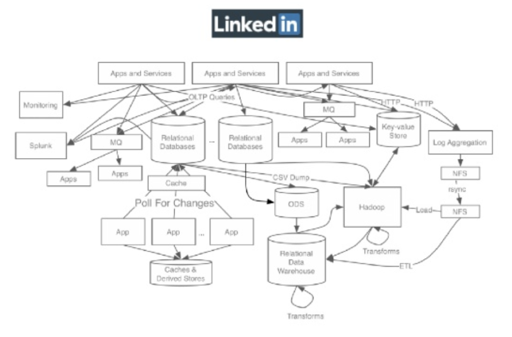
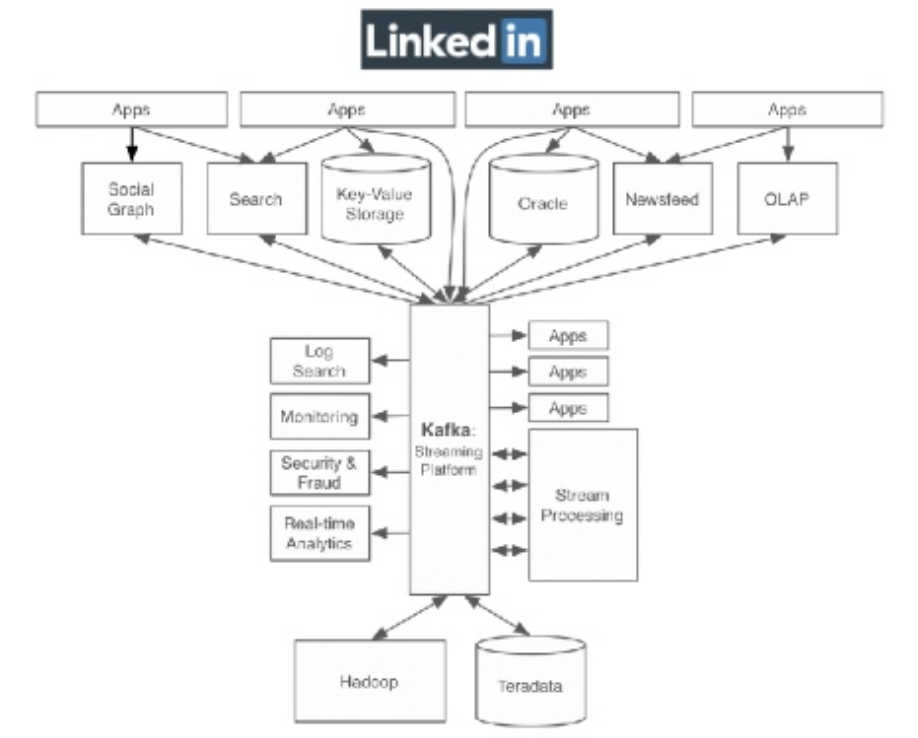
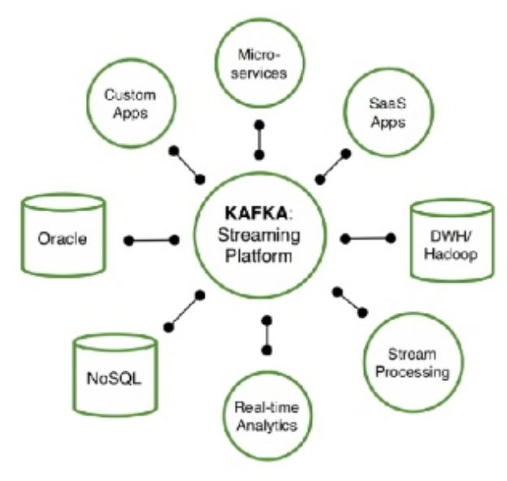
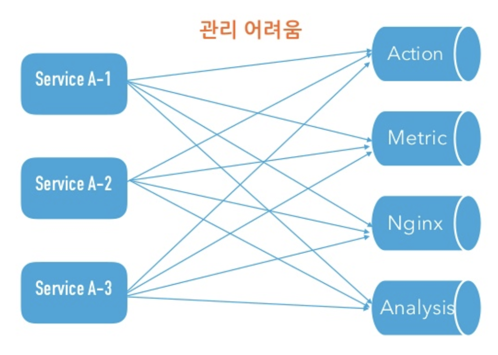
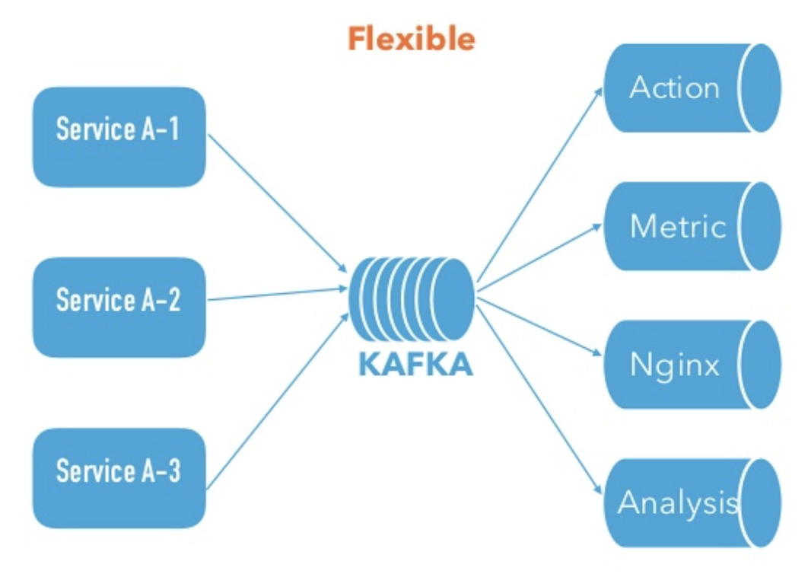
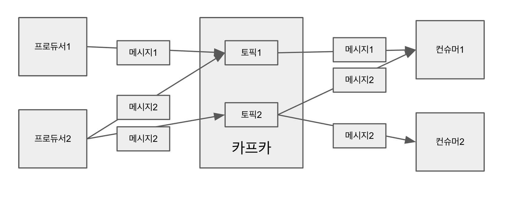
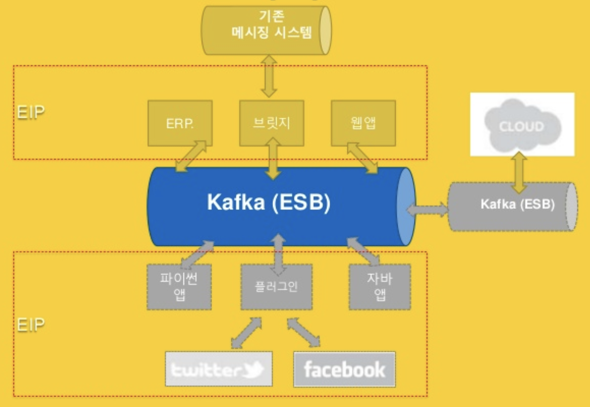
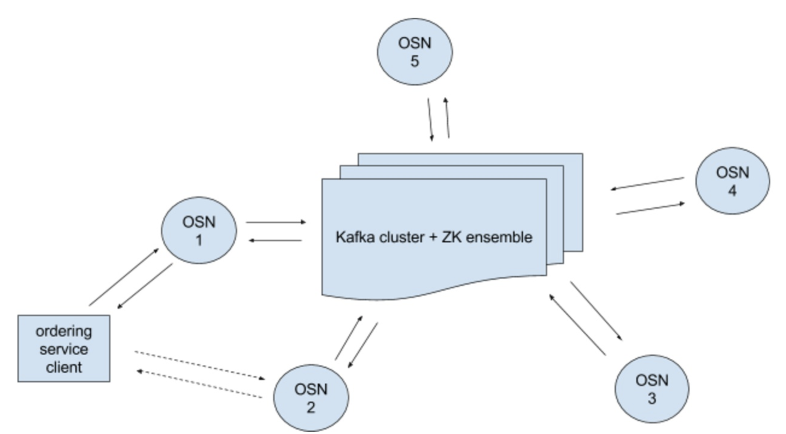

# Chapter01. 카프카란 무엇인가

## 1.1 카프카의 탄생 배경
- 링크드인에서 처음 출발한 기술
- 급속도로 성장하면서 이슈를 해결하기 위해 개발됨
    - end-to-end 연결 방식의 아키텍처 이슈
    - 실시간 OLTP 처리와 비동기 처리가 동시에 => 복잡도 증가
    - 데이터 파이프라인 관리 어려움 : 각기 다른 파이프 라인 개발 및 유지. 처리 방식, 포맷 등이 모두 다름
    
- Jay Kreps, Neha Narkhede, Jun Rao 등이 개발
    - 모든 시스템으로 데이터 전송
    - 실시간 처리 가능
    - 확장성 용이
- 새로운 시스템의 목표
    - 프로듀서와 컨슈머의 분리
    - 메시지 시스템과 같이 영구 메시지 데이터를 여러 컨슈머에게 허용
    - 높은 처리량을 위한 메시지 최적화
    - 데이터 증가에 따른 스케일아웃 가능
- 모든 이벤트/ 데이터의 흐름을 중앙에서 관리
    - 표준 포맷으로 연결
    - 카프카를 메시지 전달의 중앙 플랫폼으로
    
- 카프카
    - 2011년 초, 오픈소스
    - 2012년 10월 23일, 아파치 정식 오픈소스
    - 2014년 11월, 컨플루언트 창립, 프리미엄 버전(모니터링, 서비스 지원 등) 제공
    

## 1.2 카프카의 동작 방식과 원리
- 카프카는 기본적으로 메시징 서버로 동작
- Pub/Sub 모델
    - 중앙에 메시지 시스템 서버를 두고, 메시지를 보내고(publish), 받는(subscribe) 형태의 통신
    - 비동기 메시징 전송 방식
    - 수신자가 정해져 있지 않은 상태로 발행
    - 다이나믹한 네트워크 토폴로지, 높은 확장성
- 과거 일반적 통신 방식의 장단점
    - 장점 : 빠른 전송 속도, 전송 결과 바로 확인
    - 단점 : 장애 발생시 대기 처리 필요, 개별 연결로 인한 확장성 취약
- 펍섭 모델 방식의 장단점
    - 방식 : 중간의 메시징 시스템 전달 -> 데이터+ID -> 교환기가 메시지의 ID 확인하여 큐에 전달 -> 큐에 있는 데이터 소비
    - 장점 : 수신 불능 상태에서도 유실 안됨, N:N 가능, 확장성 용이, 데이터 유실 염려 없음
    - 단점 : 확인하려면 복잡함, 전달 속도가 빠르지 않음
- 기존 Pub/Sub 방식 특징
    - 간단한 이벤트(KB), not 데규모 데이터(MB 이상)
        - 교환기 부하
        - 컨슈머별 큐 관리
        - 메시지 정합성
        - 전달 결과 확인 위해 복잡한 프로세스 필요
    - 보관, 교환, 전달 과정에서 신뢰성 보장에 중점
    - 성능 이슈로 일부 콤포넌트나 원격 통신 밖에 적용되지 않음
- 카프카 Pub/Sub 방식
    - 메시지 교환 전달의 신뢰성 관리를 프로듀서/컨슈머에게 전가
    - 부하가 많이 걸리는 교환기 기능을 컨슈머가 만들 수 있게 처리 => 메시징 시스템 부하 줄임, 메시징 전달 성능 자체에 집중하여 고성능
- 카프카 메시지 전달 순서
    1. 프로듀서는 새로운 메시지를 카프카로 보냄
    2. 프로듀서가 보낸 메시지는 카프카에 컨슈머 큐(토픽)에 저장
    3. 컨슈머는 카프카에 접속하여 메시지 가져감

## 1.3 카프카의 특징
- 프로듀서는 컨슈머와 관계없이 메시지를 카프카로 전송
- 토픽이라는 식별자를 이용해 토픽 단위로 저장
- 컨슈머 역시 프로듀서와 관계없이 카프카에서 메시지 가져옴

### 프로듀서와 컨슈머의 분리
- 과거 : 메트릭 수집 방식을 폴링 방식 => 메트릭 수집이 늦어지는 경우 이슈 발생
- 서버 추가 시, 연동 어려움
- 특정 서버 이슈에도 연쇄 작용으로 타 서버에 영향
    
- Pub/Sub 방식 적용 => 역할 완벽히 분리
- 개별 이슈에도 연쇄 작용 확률 낮음
- 서버 추가 부담 줄일 수 있음
    

### 멀티 프로듀서, 멀티 컨슈머
- 하나의 토픽에 여러 프로듀서 또는 컨슈머 접근 가능
- 하나 이상의 토픽으로 뷰터 메시지 가져올 수 있음 => 하나의 데이터를 다양한 용도로 사용 가능
    

### 디스크에 메시지 저장
- 카프카는 디스크에 메시지를 저장하고 유지
- 기존 메시징 시스템 : 컨슈머가 메시지를 읽어가면 큐에서 메시지 삭제
- 보관 주기 동안 디스크에 메시지 저장
- 메시지 손실 없이 메시지 가져갈 수 있음
- 멀티 컨슈머 가능
- 컨슈머 이슈 발생시 다시 실행 가능

### 확장성
- 카프카 클러스터는 3대의 브로커로 시작해서 수십 대 확장 가능
- 서비스 중단 없이 확장 가능

### 높은 성능
- 고성능 유지 위해, 분산 처리, 배치 처리 등 다양한 기법 제공
- 2015년 8월 기준, 링크드인에서는 10^12개 메시지 생산, 하루에 10^15bytes 이상 데이터 처리

### 용어 정리
- 카프카 : 프로젝트 이름, 클러스터 구성 가능하기 때문에 카프카 클러스터라 부리기도
- 브로커 : 서버 또는 노드
- 토픽 : 메시지 구분을 위한 이름
- 파티션 : 병렬 처리 가능하도록 토픽 나눈 것
- 프로듀서 : 메시지 생산자
- 컨슈머 : 메시지 가져가는 소비자

## 1.4 카프카의 확장과 발전
- 2000년 초반, SOA 핵심 구성요소 중 하나인 ESB(ESB, 메시지 버스, 이벤트 버스 등)를 카프카로 쉽게 구성 가능 
- SOA : 업무를 서비스 단위로 쪼개고, 각 서비스 간의 연결은 ESB를 통해 연결
- ESB 특징
    - 멀티 프로토콜, 데이터 타입 지원
    - 느슨한 결합 : 메시지 큐
    - 정기적 데이터 획득 X => 이벤트 기반 통신
    
- 확장
    - ESB : 기업 내 데이터 버스
    - 플러그인 : 통한 외부 데이터 가져와서 기업 내 활용
    - 브릿지 : 연결해서 기존 메시징 시스템 사용
    - 퍼블릭 클라우드 : 외부 데이터 센터의 로깅/미터링/이벤트 데이터를 연결해서 가져오기
- 진화
    - 강력한 메시지 전달 능력을 바탕으로 실시간 분석 가능한 카프카 스트림즈, KSQL 등 분석으로의 진화    
    - 카프카 스트림즈 : 간단히 스트림 처리 앱 개발 가능
    - KSQL : SQL 기반 데이터 분석 가능
- 넷플릭스 사례
    - 카프카 데이터 파이프라인 적용 회사 중 가장 유명한 회사 : 넷플릭스
    - 초기 넷플릭스, 데이터 파이프라인의 유일한 목적은 배치 처리를 위해 하둡에 이벤트 저장하기
    - 시간이 지남에 따라, 실시간 분석에 대한 슈요 증가 => 파이프라인으로써 카프카 활용
        
        - 모든 이벤트가 앞단 카프카로 전송, 수집
        - 메시지 제어부에서 메시지를 보낼 곳 결정
        - 메시지 라우터 거침
        - 1) S3 저장하여 EMR 분석
        - 2) Elasticsearch 에 실시간 검색 가능하도록 인덱싱
        - 3) 컨슈머 전용 카프카에 연결
- 블록체인(하이퍼렛저) 사례
    - 블록체인 구분
        - 퍼블릭 : 누구나 접근 가능. 비트코인, 이더리움 등
        - 프라이빗 : 별도 인증 필요. 하이퍼렛저 (리눅스재단) 등
    - 대표적 하이퍼렛저 프레임워크
        - Sawtooth : 분산 원장을 실행, 배포하기 위한 모듈 플랫폼
        - Iroha : 분산 원장 기술이 필요한 인프라 프로젝트에 쉽고 간단하게 디자인된 비즈니스 플록체인 프레임워크
        - Fabric : IBM에서 지원하고 가장 많은 인기를 얻고 있음
    - Fabric에서 활용
        - OSN : 네트쿼으상의 엔티티. 모든 트랜잭션을 블록 형태의 메시지로 패키지
        - OSN을 카프카에 전달 : 절대 손실X, 순서 보장O
        
