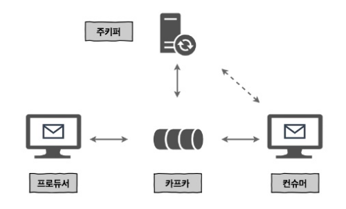
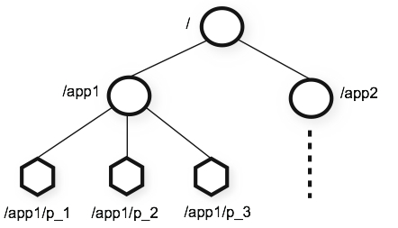

# 2. 카프마 설치

- 프로듀서는 카프카와 통신하면서 메시지를 보내는 역할
- 컨슈머는 카프카와 통신하면서 메시지를 가져오는 역할
- 컨슈머는 오프셋 정보를 주키퍼와 카프카에 저장 가능. 추후 주키퍼에 저장하는 기능은 곳 사라질 예정
- 카프카는 메타데이터 정보를 주키퍼에 저장. 카프카의 상태 관리 등의 목적으로 주키퍼 이용


## 2.1 카프카 관리를 위한 주키퍼
- 카프카는 분산 애플리케이션 관리를 위한 안정적인 코디네이션 애플리이케이션 추가 필요 : 주키퍼
- 주키퍼의 시작
    - 하둡 서브 프로젝트 중 하나로 시작.
    - 2011년 1월에 아파치 탑 레벨 프로젝트로 승격
- 분산 애플리케이션이 안정적인 서비스를 할 수 있도록 분산되어 있는 각 애플리케이션의 정보를 중앙에 집중하고 구성 관리, 그룹 관리 네이밍, 동기화 등의 서비스 제공
    
- 분산 애플리케이션들이 각각 클라이언트가 되어 주키퍼 서버들과 커넥션을 맺은 후 상태 정보등을 주고 받게 됨
- znode
    - 
    - 데이터를 저장하기 위한 공간 이름
    - 파일이나 폴더 개념과 유사
    - key-value 형태로 znode에 상태 정보 저장
    - 일반적으로 B ~ KB 정도로 매우 작은 데이터 저장
    - 계층형 구조
- 버전 번호
    - 데이터 변경 등에 대한 유효성 검사 등을 위해 버전 번호를 관리
    - 변경될 때마다 지노드의 버전 번호 증가
- 주키퍼에 저장되는 데이터는 모두 메모리에 저장되어 처리량이 매우 크고 속도 또한 빠름
- 주키퍼 앙상블 (주키퍼 클러스터)
    - 서버를 홀수로 구성해야 함
    - 과반수 방식에 따라 살아 있는 노드 수가 과반 수 이상 유지되면 서비스 가능
    - 앙상블 서버들을 랙별로, 스위치 분리해서 구성하면 장애 상황 회피 가능


## 2.2 주키퍼 설치

### openjdk 설치
- zookeeper는 Java 필요
```bash
$ yum -y install java-1.8.0-openjdk
```

### zookeeper 설치
- 다운로드 받아서 압축 풀기
```bash
$ cd /usr/local/
$ wget http://.../zookeeper-3.4.10.tar.gz
$ tar xzvf zookeeper-3.4.10.tar.gz
$ ln -s zookeeper-3.4.10 zookeeper
$ mkdir /data
$ echo 1 > /data/myid
```

- 주키퍼는 애플리케이션에서 별도의 데이터 디렉토리를 사용
    - 이 디렉토리에는 지노드의 복사본인 스냅샷, 트랜잭션 로그 저장
    - 트랜잭션 로그 : 지노드에 변경사항이 발생하면, 이러한 변경 사항은 트랜잭션 로그에 추가
    - 스냅샷 : 로그가 어느 정도 커지면, 현재 모든 지노드의 상태 스냅샷이 파일시스템에 저장. 모든 이전 로그들을 대체
- myid
    - 주키퍼 노드 구분을 위한 ID
    - 정수 형태

### 설정
```bash
$cat /usr/local/zookeeper/conf/zoo.cfg
tickTime=2000   # 기본 시간 단위 (밀리초)
initLimit=10    # 팔로워가 리더와 초기 연결하는 시간에 대한 타임아웃 (tick수)
syncLimit=5     # 팔로워가 리더와 동기화하는 시간에 대한 타임아웃 (tick수)
dataDir=/data   # 스냅샷, 트랜잭션 로그의 데이터 저장 경로
clinetPort=2181 # 주키퍼 리스닝 포트

# 앙상블 구성을 위한 서버 설정 server.myid 형식.
# default : 2888,3888.
# 앙상블 노드끼리 연결에 사용
server.1=peter-zk001:2888:3888  
server.2=peter-zk002:2888:3888
server.3=peter-zk003:2888:3888
$
```

### 실행 / 종료
```
$ bin/zkServer.sh start # 실행
$ bin/zkServer.sh stop # 종료
```

### 서비스 등록 (systemd)
- systemd
    - 리부팅시 자동 시작
    - 효율적 프로세스 관리
    - /etc/systemd/system 에 서비스 등록
- zookeeper를 systemd에 등록
    ```bash
    $ cat /etc/systemd/service/zookeeper-server
    [Unit]
    Description=zookeeper-server
    After=network.target

    [Service]
    Type=forking
    User=root
    Group=root
    SyslogIdentifier=zookeeper-server
    WorkingDirectory=/usr/local/zookeeper
    Restart=always
    RestartSec=0s
    ExecStart=/usr/local/zookeeper/bin/zkServer.sh start
    ExecStop=/usr/local/zookeeper/bin/zkServer.sh stop

    [Install]
    WantedBy=multi-user.target
    $ systemctl daemon-reload
    ```
- 서비스 시작/종료
    ```bash
    $ systemctl start zookeeper-server.service # 실행
    $ systemctl stop zookeeper-server.service # 종료
    $ systemctl restart zookeeper-server.service # 재시작
    $ systemctl enable zookeeper-server.service # 부팅시 시작
    $ systemctl status zookeeper-server.service # 상태 확인


## 2.3 카프카 설치
- 카프카 클러스터는 홀수 구성하지 않아도 됨
- 주키퍼와 카프카는 서로 별도의 서버에 구성하기를 권장

### 카프카 설치
- 다운로드 후 압축 풀기
    ```bash
    $ cd /usr/local/
    $ wget http://.../kafka_2.11-1.0.0.tgz
    $ tar xzvf kafka_2.11-1.0.0.tgz
    $ ln -s kafka_2.11-1.0.0 kafka

### 환경설정
- 서버별 브로커 아이디, 카프카 저장 디렉토리 주키퍼 정보 설정 필요
- 메시지를 저장할 디렉토리 필요. 하나 이상으로 구성 가능.
- 디스크가 여러개인 경우 각 디스크의 수만큼 디렉토리를 만들어줘야 각 디스크별로 I/O 분산 가능
- 주키퍼와 카프카
    - 주키퍼 앙상블 내 모든 서버는 같은 정보를 가지고 있음
    - 모든 카프카에서 하나의 주키퍼 서버를 선택 가능
    - 장애 대응을 위해 모든 주키퍼 앙상블 서버 리스트를 모두 입력해야 함
        ```bash
        zookeeper.connect=peter-zk001:2181,peter-zk002:2181,peter-zk003:2181
        ```
    - 호스트이름과 포트정보만 입력한 경우 지노드의 최상위 경로를 사용
        ```bash
        zookeeper.connect=peter-zk001:2181,peter-zk002:2181,peter-zk003:2181/peter-kafka01
        zookeeper.connect=peter-zk001:2181,peter-zk002:2181,peter-zk003:2181/peter-kafka02
        ```
        ```bash
        zookeeper.connect=peter-zk001:2181,peter-zk002:2181,peter-zk003:2181/peter-kafka/01
        zookeeper.connect=peter-zk001:2181,peter-zk002:2181,peter-zk003:2181/peter-kafka/02
        ```
- 설정파일
    ```bash
    $ cat /usr/local/kafka/config/server.properties
    broker.id=0 # 브로커 아이디
    log.dirs=/tmp/kafka-logs # 디렉토리
    zookeeper.connect=localhost:2181 # 주키퍼 앙상블 리스트
    $
    ```
- 실행 / 종료
    ```bash
    $ bin/kafka-server-start.sh server.properties -daemon
    $ bin/kafka-server-stop.sh server.properties
    ```
- systemd 등록
    ```bash
    $ cat kafka-server.service
    [Unit]
    Description=kafka-server
    After=network.target

    [Service]
    Type=simple
    User=root
    Group=root
    SyslogIdentifier=kafka-server
    WorkingDirectory=/usr/local/kafka
    Restart=no
    RestartSec=0s
    ExecStart=/usr/local/kafka/bin/kafka-server-start.sh /usr/local/kafka/config/server.properties
    ExecStop=/usr/local/kafka/bin/kafka-server-stop.sh
    $
    ```


## 2.4 카프카 상태 확인

### TCP 포트 확인
```bash
$ netstat -nltp | grep 2181
```

### 주키퍼 지노드를 이용한 카프카 정보 확인
```bash
$ bin/zkCli.sh
[] ln /
[zookeeper, peter-kafka]
[] ls /peter-kafka/brokers/ids
[1 2, 3]
```

### 카프카 로그 확인
```bash
cat /usr/local/kafka/logs/server.log
```

## 2.5 카프카 시작하기

### 토픽 생성
```bash
$ bin/kafka-topics.sh --zookeeper zk001:2181,peter-zk002:2181,peter-zk003:2181/peter-kafka --replication-factor 1 --partitions 1 --topic peter-topic --create
```

### 토픽 삭제
```bash
$ bin/kafka-topics.sh --zookeeper zk001:2181,peter-zk002:2181,peter-zk003:2181/peter-kafka --replication-factor 1 --partitions 1 --topic peter-topic --delete
```

### 프로듀서
```bash
$ bin/kafka-console-producer.sh --broker-list peter-kafka001:9092,peter-kafka002:9092,peter-kafka003:9092 --topic peter-topic
```

### 컨슈머
```bash
$ bin/kafka-console-consumer.sh --bootstrap-server peter-kafka001:9092,peter-kafka002:9092,peter-kafka003:9092 --topic peter-topic --from-beginning
```
