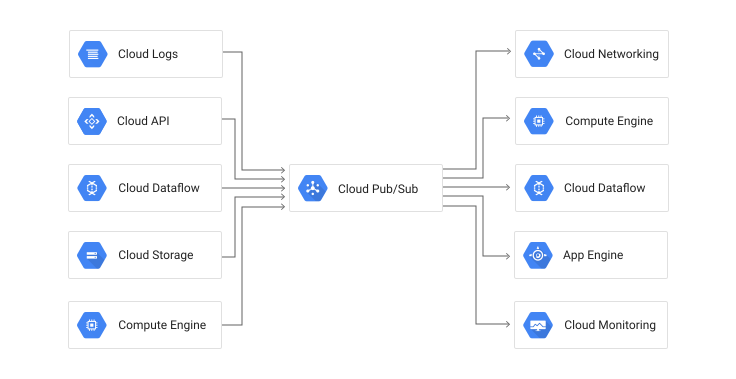
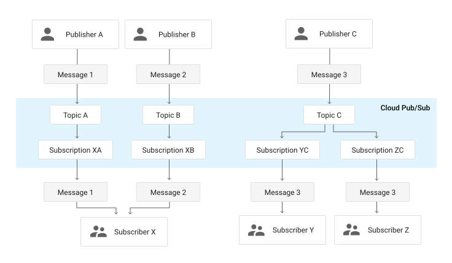

# 10. 클라우드 기반 메시징 서비스

- 클라우드 기반 메시지 서비스 소개와 이해
- 구글의 펍/섭 서비스 연동과 사용
- 아마존 키네시스 서비스 연동과 사용
- 카프카와의 장단점 비교

## 클라우드 메시징 서비스?

- 규모가 크지 않은 조직에서 자체적으로 카프카 클러스터 운영이 어려운 경우, 클라우드의 메시징 서비스를 사용하는 것이 바람직
- 주요 클라우드 별 메시징 서비스
  * 구글 - 펍/섭 (Pub/Sub)
  * 아마존 - 키네시스 (Kinesis)
  * 애저 - 이벤트 허브 (Event Hubs)
  * 오라클 - 이벤트 허브 (EventHub)

## Google Cloud Pub/Sub

- 구글 클라우드 내부 혹은 외부 서비스에서 메시지를 주고받기 위한 클라우드 서비스
- 기존의 카프카와 컨셉 및 사용법이 거의 동일
- 통신 유형: 일대다(Fan-in), 다대일(Fan-out), 다대다

### Fan-in vs Fan-out

### 특장점

1. 하나의 메시징 플랫폼으로 단일화 사용 가능
2. push/pull 형태의 메시지 전달 방법 설정
3. 신뢰성 있는 데이터 보장
4. 명시적인 ACK 제공
5. 플로 컨트롤 제공
6. JSON 기반의 Rest API 제공

### 용어

- 토픽: 카프카의 토픽과 동일
- 구독: 컨슈머 그룹과 유사한 개념. 메시지를 읽었는지, ACK 리스트 등을 관리
- 메시지: 프로듀서가 생성한 데이터와 속성 값
- 메시지 속성: 메시지의 내용 외에 특성을 나타낼 수 있는 키/값 쌍

### 기타 사항

- 가격 정책: https://cloud.google.com/pubsub/pricing
- SLA: https://cloud.google.com/pubsub/sla
- 기본 성능 및 한도: https://cloud.google.com/pubsub/quotas

## Amazon Kinesis

- 실시간 스트리밍 데이터를 수집, 분석 처리하기 위한 클라우드 서비스
- Google Pub/Sub과 거의 동일한 사용법
- 비디오, 오디오, 애플리케이션 로그, 웹 사이트 클릭스트림 및 IoT 텔레메트리 데이터와 같은 실시간 데이터를 수집

### 특장점

1. 70밀리초 이내에 어플리케이션, Amazon S3, AWS Lambda에 스트리밍 데이터 제공
2. 데이터 센터 3개에 걸쳐 스트리밍 데이터를 동기식으로 복제하여 안정성 확보
3. 민감한 데이터를 암호화하고 Amazon Virtual Private Cloud(VPC)를 통해 데이터에 비공개로 액세스하여 보안 강화
4. SDK, 라이브러리, 커넥터, 에이전트 등 사용하여 쉽게 스트리밍 어플리케이션 구축
5. 메가바이트에서 테라바이트 규모로 실시간 확장 가능
6. 선수금 없이 사용량에 따라 요금 부과

### 용어

- 샤드: 스트림을 구성하는 데이터 저장소
- 프로듀서: KPL(Kinesis Producer Library)을 사용해 스트림에 데이터 레코드를 넣는 프로그램
- 컨슈머: KCL(Kinesis Client Library)을 사용해 스트림에 데이터 레코드를 읽어가는 프로그램
- 데이터 레코드: 키네시스 스트림에 저장되는 데이터 단위. **시퀀스 번호**, **파티션 키**, **데이터 값**으로 구성
- 시퀀스 번호: 데이터 레코드에 쓰이는 번호
- 파티션 키: 샤드에 분산하기 위해 사용하는 키

### 기타 사항

- 가격 정책: https://aws.amazon.com/ko/kinesis/data-streams/pricing
- FAQ(SLA, 보안, 암호화 등): https://aws.amazon.com/ko/kinesis/data-streams/faqs

## 카프카와 클라우드 서비스 비교

||Kafka|Kinesis|Pub/Sub|
|---|---|---|---|
|개발사|Linkedin|Amazon|Google|
|사용형태|DIY|Cloud Service|Cloud Service|
|SDK|Java/Python|Java/Python/Go/.Net|Java/Python/Go|
|리플리케이션 팩터|조정 가능|조정 불가|조정 불가|
|성능|구성에 따라 다양함|샤드 1MB/초 쓰기, 2MB/초 읽기|100MB/초 읽기, 쓰기|
|ACK|주키퍼에 저장|Amazon DynamoDB에 저장|Pub/Sub 자체 관리|
|데이터 저장 기간|조정 가능|최대 7일|최대 7일|
|메시지 순서|파티션 단위|샤드 단위|토픽 단위|
|운영 인원|필요|필요 없음|필요 없음|
|운영 비용|장비/인건비|사용료|사용료|
